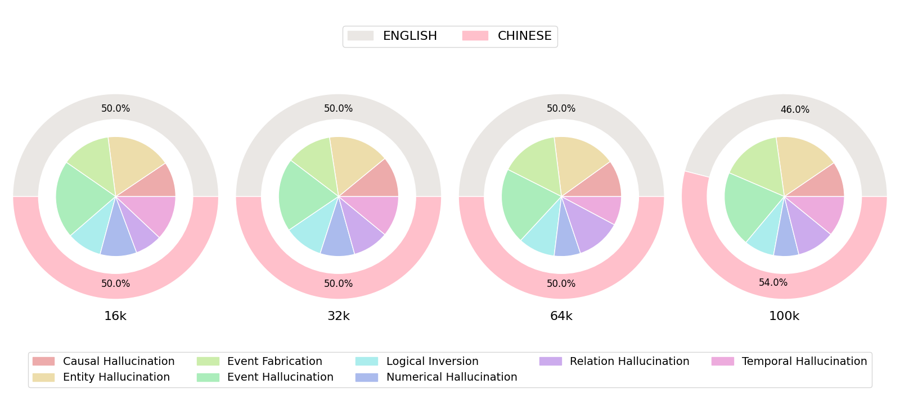

# 📖 LongNovel: A Multi-Scale Benchmark for Hallucination Detection in Long-Context Novel Summarization
<p align="center">
  <a href="https://arxiv.org/abs/2608.18082"></a>
  <a href="https://github.com/BDML-lab/LongNovel/"></a>
  <a href="https://huggingface.co/datasets/SII-BDML/LongNovel/"></a>
</p>

---
## Overview

While modern LLMs feature expanded context windows, hallucination remains a critical bottleneck—especially in long-context summarization. **LongNovel** is a multi-scale, bilingual (Chinese and English) benchmark specifically designed to study and detect hallucinations in long narrative texts.

### Why Novels?
Unlike short news articles or academic papers, long novels feature dense, intrinsic narrative structures, intricate event descriptions, and complex dialogues. This makes them the ideal testing ground for tracking how hallucinations evolve as context length scales.

### Key Features & Contributions

* **Bilingual & Multi-Scale Dataset:** Built using 29 Chinese novels (ranging from 16k to 100k tokens) alongside chapter-level English data from the BookSum dataset.
* **Granular Taxonomy:** Defines **8 distinct hallucination types** to categorize model errors precisely.

<div style="text-align: center;">
  
</div>

## Updates

- `2026-06` We release LongNovel benchmark.

## Contents

- [Overview](#overview)
- [Updata](#updates)
- [Dataset](#dataset)
- [Evaluation](#evaluation)
- [Results](#results)
- [License](#license)
- [Acknowledgement](#acknowledgement)
- [Citation](#citation)


## Dataset
<p align="center">
  
</p>

### Load Data
You can download and load the LongNovel data through [this link](https://huggingface.co/datasets/SII-BDML/LongNovel) :

```Python
from datasets import load_dataset

# Load the dataset
dataset = load_dataset('SII-BDML/LongNovel', split='test')
```
### Data Format

The data format in **LongNovel** is structured as follows:

```json
{
    "id": "Unique identifier for each piece of data",
    "language": "The language of the data, which can be 'zh' for Chinese or 'en' for English",
    "article": "The original text corresponding to the summary to be detected",
    "summary": "The summary text that needs to be checked for hallucinations",
    "instruction": "The prompt or instruction used during the hallucination detection process",
    "input": "The complete string fed into the model, which contains both the article and the summary",
    "output": "The hallucination detection result"
}
```

## Evaluation

The script automatically configures rope_scaling based on the model path and context length. By default, it uses Tensor Parallelism (TP) of 8, making it suitable for multi-GPU setups

### Run Model Inference

**Run a standard 64k evaluation:**

```bash
python run_inference.py --model Qwen3-32B --long_context 64k

```

**Run with Chain of Thought reasoning on a 32k validation set:**

```bash
python run_inference.py --model Qwen3-32B --long_context 32k --mode CoT --data_split validation

```
---

### Args
`--model <name_or_path>`
> The identifier for the model. It defaults to `Qwen3-32B`. 
`--long_context <size>`
> Sets the context length and determines which dataset file to load.
> **Options:** `16k`, `32k`, `64k`, `100k`.

`--mode <type>`
> Defines the prompting strategy.
> * `""` (Default): Standard Hallucination Detection inference.
> * `CoT`: Enables **Chain of Thought** processing for better reasoning.
> * `PromptB`: **Reorders the input**, placing the summary before the article text.

`--data_split <split>`
> Specifies which data subset to evaluate.
> * `test`: (Default) Uses test sets.
> * `validation`: Uses validation sets (only supported for 16k/32k).


## Results

We introduce LongNovel, a multilingual long-context dataset for hallucination detection in novels, based on human-annotated summaries. It comprises four subsets ranging from 16k to 100k tokens. Our extensive experiments on LongNovel reveal that current large language models still lack sufficient capability in long-context hallucination detection tasks. We hope that LongNovel will provide useful insights for future research in this field.

<p align="center">
  
  <br>
    <b>Recall performance of various LLMs across different hallucination types.</b>
    <br>
    <small>
      <font color="#666">
        <b>Evt</b>: Event, <b>Ent</b>: Entity, <b>Rel</b>: Relation, <b>Num</b>: Numerical, 
        <b>Tmp</b>: Temporal, <b>Cau</b>: Causal, <b>Log</b>: Logical Inversion, <b>Fab</b>: Fabrication.
      </font>
    </small>
</p>

## License

This project is licensed under the [Apache License 2.0](LICENSE).

## Acknowledgement

We would like to express our gratitude to the annotators from iQIYI for their high-quality manual labeling and correction. We also thank iQIYI for providing the GPU resources that supported this work. Furthermore, we thank the creators and maintainers of the BookSum dataset. Our work utilizes the processed version from the [ubaada/booksum-complete-cleaned](https://huggingface.co/datasets/ubaada/booksum-complete-cleaned) repository. We deeply appreciate both the original BookSum authors and the community contributors for making these valuable resources available.

## Citation

If you find our benchmark and code useful, please consider citing our work:

```bibtex
@misc{zhang2026longnovelmultiscalebenchmarkhallucination,
      title={LongNovel: A Multi-Scale Benchmark for Hallucination Detection in Long-Context Novel Summarization}, 
      author={Ruizhi Zhang and Jinwei Chen and Xiangju Lu and He Yan and Mo Yu and Junmin Zhu and Wei Zhang},
      year={2026},
      eprint={2608.18082},
      archivePrefix={arXiv},
      primaryClass={cs.CL},
      url={https://arxiv.org/abs/2608.18082}, 
}
```


