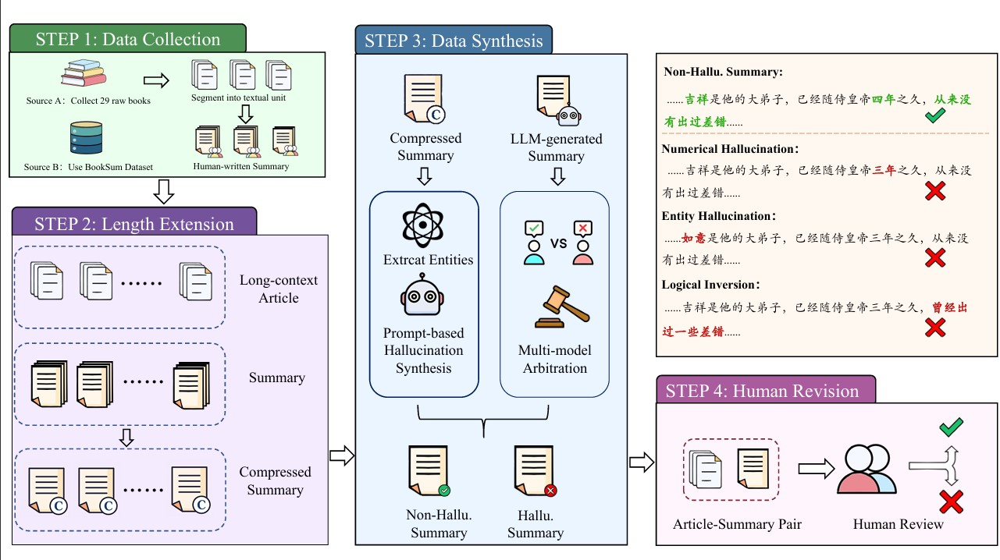

<p align="center">
  <a href="--"></a>
  <a href="https://github.com/BDML-lab/LongNovel/"></a>
  <a href="https://huggingface.co/datasets/SII-BDML/LongNovel/"></a>
</p>

---
## Overview

Although context windows have expanded significantly in recent years, hallucinations in long-context summarization remain a challenge. Long novels are better suited than news or papers for researching these hallucinations, due to their intrinsic information and detailed descriptions of events and dialogues. However, current research lacks a multi-scale benchmark for hallucination detection in long-context novel summarization and does not fully explore how hallucinations change as the context grows longer. In this study, we propose LongNovel, a multi-scale long-context bilingual (Chinese and English) novel benchmark for hallucination detection. This benchmark is constructed from 29 Chinese novels (ranging from 16k to 100k tokens) and chapter-level data from the BookSum dataset. We design 8 hallucination types and employ a combination of Multi-Model Arbitration and Entity-Referenced Hallucination Generation to ensure both data authenticity and a balanced distribution of hallucination categories. Furthermore, we manually revise the content in the test set to guarantee data reliability. Extensive experimental results demonstrate that LongNovel is a challenging benchmark. We release LongNovel for future research.

<div style="text-align: center;">
  
</div>

## Updata

- `2026-06` We release LongNovel benchmark.

## Contents

- [Overview](#overview)
- [Updata](#updata)
- [Dataset](#dataset)
- [Results](#results)
- [License](#license)
- [Acknowledgement](#acknowledgement)
- [Citation](#citation)


## Dataset
### Load Data
You can download and load the LongNovel data through [this link](https://huggingface.co/datasets/SII-BDML/LongNovel) :

```Python
from datasets import load_dataset

# Load the dataset
dataset = load_dataset('SII-BDML/LongNovel', split='test')
```
### Data Format

The data format in **LongNovel** is structured as follows:

```json
{
    "id": "Unique identifier for each piece of data",
    "language": "The language of the data, which can be 'zh' for Chinese or 'en' for English",
    "article": "The original text corresponding to the summary to be detected",
    "summary": "The summary text that needs to be checked for hallucinations",
    "instruction": "The prompt or instruction used during the hallucination detection process",
    "input": "The complete string fed into the model, which contains both the article and the summary",
    "output": "The hallucination detection result"
}
```


## Results

We introduce LongNovel, a multilingual long-context dataset for hallucination detection in novels, based on human-annotated summaries. It comprises four subsets ranging from 16k to 100k tokens. Our extensive experiments on LongNovel reveal that current large language models still lack sufficient capability in long-context hallucination detection tasks. We hope that LongNovel will provide useful insights for future research in this field.

<p align="center">
  
</p>

## License

This project is licensed under the [Apache License 2.0](LICENSE).

## Acknowledgement

We would like to express our gratitude to the annotators from iQIYI for their high-quality manual labeling and correction. We also thank iQIYI for providing the GPU resources that supported this work. Furthermore, we thank the creators and maintainers of the BookSum dataset. Our work utilizes the processed version from the [ubaada/booksum-complete-cleaned](https://huggingface.co/datasets/ubaada/booksum-complete-cleaned) repository. We deeply appreciate both the original BookSum authors and the community contributors for making these valuable resources available.

## Citation

If you find our benchmark and code useful, please consider citing our work:

```bibtex
The ArXiv link will be added soon.
```


